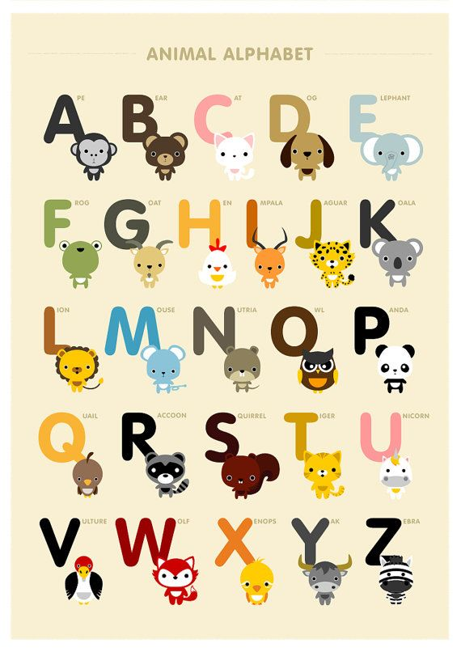

[Metasyntactic variable](https://en.wikipedia.org/wiki/Metasyntactic_variable)
names to use for spaces, based on this abecedary:

- Ape
- Bear
- Cat
- Dog
- Elephant
- Frog
- Goat
- Hen
- Impala
- Jaguar
- Koala
- Lion
- Mouse
- Nutria
- Owl
- Panda
- Quail
- Raccoon
- Squirrel
- Tiger
- Unicorn
- Vulture
- Wolf
- Xenops
- Yak
- Zebra

The simple tests are named `simple-ape`, `simple-bear`... to `simple-zebra`.
They are each assigned the ports in the range resp. `701*`, `702*`... to `726*`:

- `simple-ape`: 701*
- `simple-bear`: 702*
- `simple-cat`: 703*
- `simple-dog`: 704*
- `simple-elephant`: 705*
- `simple-frog`: 706*
- `simple-goat`: 707*
- `simple-hen`: 708*
- `simple-impala`: 709*
- `simple-jaguar`: 710*
- `simple-koala`: 711*
- `simple-lion`: 712*
- `simple-mouse`: 713*
- `simple-nutria`: 714*
- `simple-owl`: 715*
- `simple-panda`: 716*
- `simple-quail`: 717*
- `simple-raccoon`: 718*
- `simple-squirrel`: 719*
- `simple-tiger`: 720*
- `simple-unicorn`: 721*
- `simple-vulture`: 722*
- `simple-wolf`: 723*
- `simple-xenops`: 724*
- `simple-yak`: 725*
- `simple-zebra`: 726*
