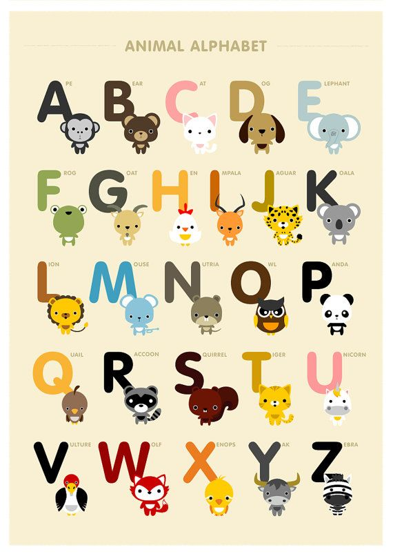

[Metasyntactic variable](https://en.wikipedia.org/wiki/Metasyntactic_variable)
names to use for projects, based on this abecedary:

- Ape
- Bear
- Cat
- Dog
- Elephant
- Frog
- Goat
- Hen
- Impala
- Jaguar
- Koala
- Lion
- Mouse
- Nutria
- Owl
- Panda
- Quail
- Raccoon
- Squirrel
- Tiger
- Unicorn
- Vulture
- Wolf
- Xenops
- Yak
- Zebra
